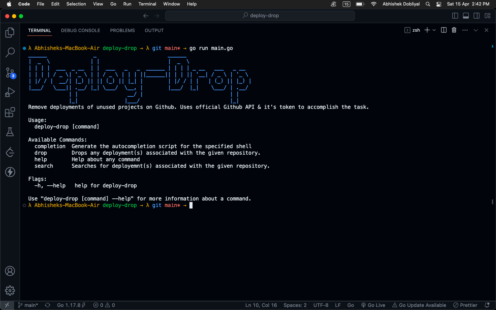
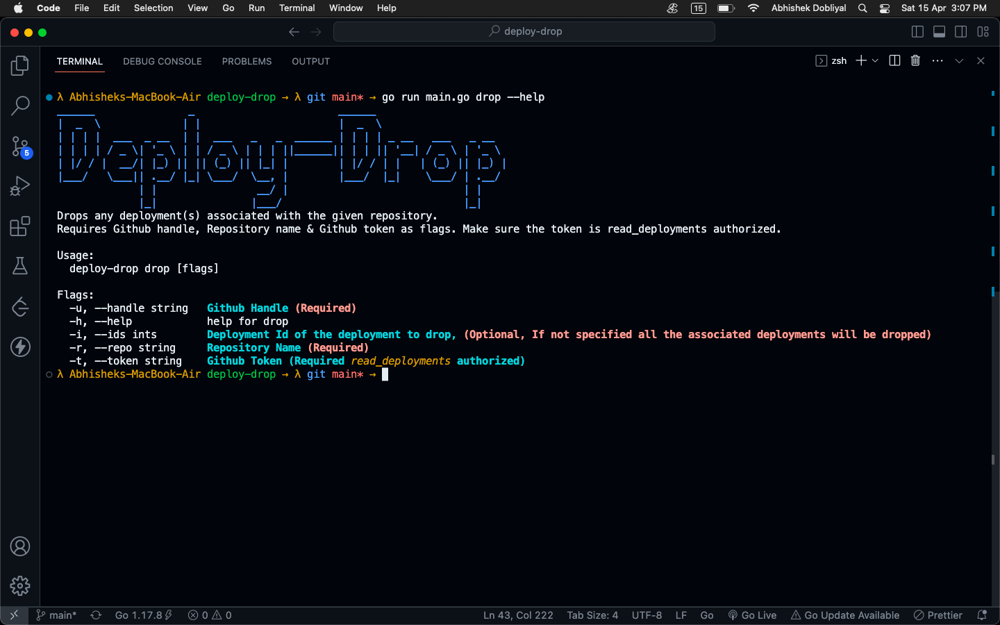

# Deploy-Drop
A command-line utility to remove all deployments from a (inactive) github repository. 




### Installation & Dependencies

- [GoLang](https://go.dev/)
- [Cobra](https://github.com/spf13/cobra)

### Usage

- Navigate to the project directory via Terminal/ Powershell and type in:

```bash
go mod tidy
```

- Once completed, run the `main.go` file by typing:

```bash
go run main.go
```

- To create an executable, type in:

```go
go build
```

> If you are new to GoLang and want to implement this project from scratch, It is highly recommended to read through [this](https://www.digitalocean.com/community/tutorials/how-to-use-go-modules) article.

### Note
- Kindly do not move, delete, rename or modify any files (unless you know what you are doing).
- Feel free to make enhancements and raise a PR.
